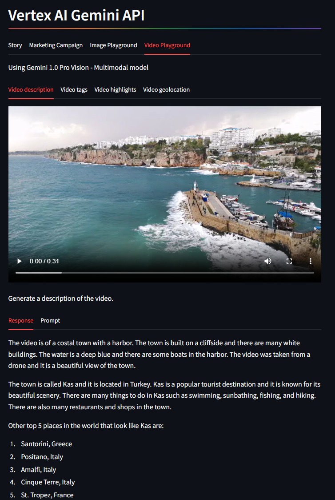
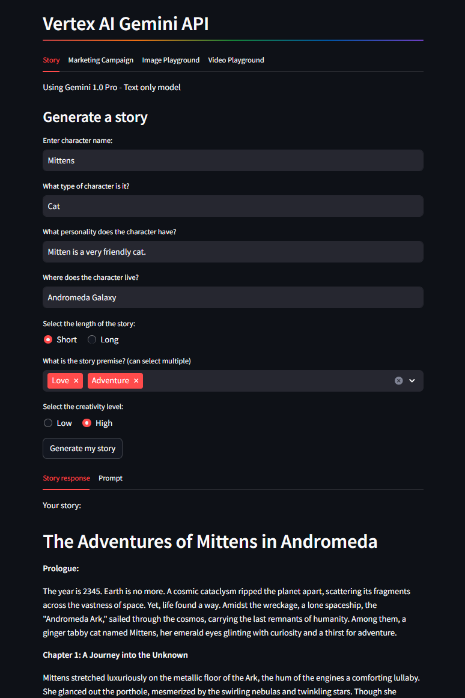
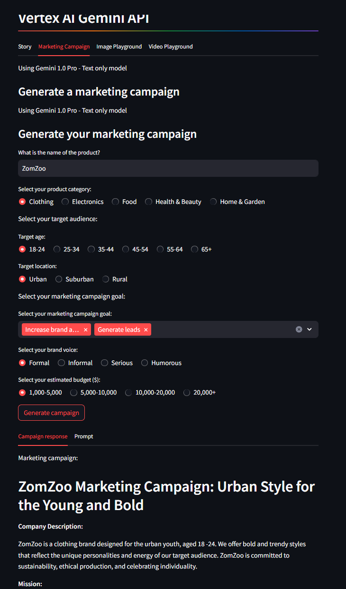
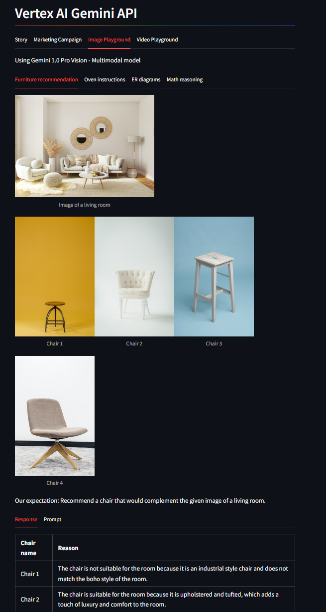

# Vertex AI Gemini API Learning Journey

Welcome to my GitHub repository documenting my exploration and learning experience with the Vertex AI Gemini API. This repository showcases my attempts to harness the power of the Gemini models, focusing on their multi-modality and long-context capabilities.

## Overview

The Vertex AI Gemini API offers a unique blend of multi-modal and long-context abilities. This repository is structured to highlight my progress, experiments, and insights as I navigate through different features and functionalities of the API.

## Application Features

The application built using the Vertex AI Gemini API is divided into four main sections:

1. **Story**
2. **Marketing Campaign**
3. **Image Playground**
4. **Video Playground**

Each section is designed to utilize specific parameters to modify the model's output, providing a comprehensive understanding of how to effectively use and compare the Gemini models.

## Application Sections and Parameters

### 1. Story
- **Description**: This section allows for the creation and manipulation of textual narratives.
- **Parameters**: Adjustments in narrative style, length, tone, etc.

### 2. Marketing Campaign
- **Description**: Focused on generating marketing content.
- **Parameters**: Target audience, campaign tone, medium (text/image/video), etc.

### 3. Image Playground
- **Description**: A playground for image generation and manipulation.
- **Parameters**: Image style, content specifics, color palette, etc.

### 4. Video Playground
- **Description**: Enables the creation and editing of videos.
- **Parameters**: Video length, content specifics, visual style, etc.

## Screenshots

Here are some screenshots of the application in action:

### Video Playground Section


### Story Section


### Marketing Campaign Section


### Image Playground Section



## Usage

To get started with the repository:

1. Clone the repository:
    ```bash
    git clone https://github.com/melfeki/VertexAI-Gemini.git
    ```

2. Navigate to the project directory:
    ```bash
    cd repo_name
    ```

3. Install the necessary dependencies:
    ```bash
    pip install -r requirements.txt
    ```

4. Run the application:
    ```bash
    python app.py
    ```

## Contributing

Contributions are welcome! Please feel free to submit a Pull Request or open an issue for any bugs or feature requests.


## Contact

For any inquiries, please contact [your-email@example.com](mailto:m.elfeki11@gmail.com).

---

Thank you for visiting my repository. I hope you find this project insightful and valuable!
